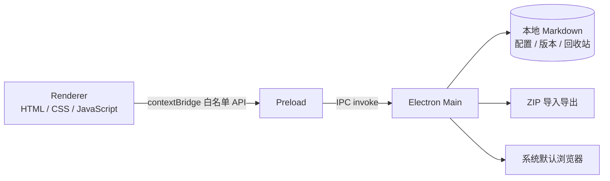

# Prompt Flow Manager

> 一款本地优先的提示词与 AI 工作流桌面管理工具。

[](https://nodejs.org/)
[](https://www.electronjs.org/)
[](https://github.com/qiqiqi-max/Prompt-Flow-Manager)
[](LICENSE)

Prompt Flow Manager 用于集中整理项目开发中反复使用的提示词、模板和执行流程。所有内容都以 Markdown 文件保存在本地，不依赖云端服务，也不绑定任何特定 AI 平台；需要使用时，直接搜索、预览并复制到 ChatGPT、Claude、Codex 或其他工具即可。

它解决的不是“再做一个聊天客户端”，而是提示词资产散落、版本难追踪、流程难复用的问题。

## 目录

- [核心能力](#核心能力)
- [适用场景](#适用场景)
- [快速开始](#快速开始)
- [使用指南](#使用指南)
- [文件格式](#文件格式)
- [数据与备份](#数据与备份)
- [架构与安全](#架构与安全)
- [开发与测试](#开发与测试)
- [项目结构](#项目结构)
- [许可证](#许可证)

## 核心能力

| 能力 | 说明 |
| --- | --- |
| 分类管理 | 按项目阶段或自定义目录组织提示词、工作流与模板 |
| 全文搜索 | 搜索标题、标签和正文，支持关键词高亮及阶段、工程类型、标签筛选 |
| Markdown 编辑 | 编辑与预览原地切换，支持 `Ctrl+S` 保存、代码块一键复制 |
| 工作流可视化 | 根据工作流文件自动生成流程图，点击节点即可跳转到对应提示词 |
| 多标签页 | 同时打开多个提示词，并在重启后恢复上次的标签页和活动状态 |
| 版本历史 | 每次保存自动生成快照，可星标、查看差异和回滚；默认保留最近 30 个未星标版本 |
| 安全删除 | 文件先进入回收站，可恢复；重要文件可锁定，主进程会强制阻止删除 |
| 导入与导出 | 导入单个 Markdown 或 ZIP 备份，导出单个提示词或整个内容库 |
| 个性化 | 明暗主题、中英文界面、自定义工程类型、可调节侧边栏 |
| 高效操作 | 最近打开、创建副本、文件树键盘导航和常用快捷键 |

应用对大规模提示词库做了针对性优化：文件内容与解析结果按修改时间和大小缓存，目录树与元数据一次遍历返回，搜索时复用正文索引。项目内置的基准脚本可用于复测这些性能路径。

## 适用场景

- 为不同项目阶段建立可复用的提示词库，例如需求、编码、审查、测试和部署。
- 把一组相互依赖的提示词编排成可视化工作流。
- 在调整提示词时保留历史版本，随时对比或回滚。
- 以普通 Markdown 文件沉淀团队或个人方法，不被专有格式锁定。
- 在离线或对隐私敏感的环境中管理提示词内容。

## 快速开始

### 环境要求

- Node.js 18 或更高版本，推荐 Node.js 20+
- npm 9+
- Windows 10/11（当前打包目标）

### 从源码运行

```bash
git clone https://github.com/qiqiqi-max/Prompt-Flow-Manager.git
cd Prompt-Flow-Manager
npm ci
npm start
```

Windows 用户也可以在安装依赖后双击 `启动应用.bat`。

### 构建便携版

```bash
npm run dist
```

生成的 portable `.exe` 位于 `dist/`。构建前会自动同步渲染进程依赖到 `src/vendor/`，最终程序不需要联网加载前端库。

## 使用指南

| 操作 | 入口或快捷键 |
| --- | --- |
| 新建提示词 | 工具栏“+ 提示词”、`Ctrl+N`，或文件树右键菜单 |
| 新建工作流 | 工具栏“+ 工作流” |
| 搜索内容 | 顶部搜索框，`Ctrl+Shift+F` 聚焦 |
| 编辑与保存 | 内容区“编辑”，`Ctrl+S` 保存 |
| 复制提示词 | 内容区“复制” |
| 创建副本 | 文件树右键“创建副本” |
| 查看版本 | 内容区“历史”打开版本抽屉 |
| 重命名、移动、删除 | 内容区操作按钮或文件树右键菜单 |
| 锁定文件 | 文件树右键“锁定（防误删）” |
| 导入或导出 | 顶部工具栏相应按钮，`Ctrl+E` 导出备份 |
| 切换主题 | 工具栏主题按钮，`Ctrl+Shift+L` |
| 文件树导航 | 聚焦文件树后使用 `↑` / `↓` |
| 关闭抽屉或退出编辑 | `Esc` |

## 文件格式

### 提示词

提示词是带 YAML frontmatter 的 `.md` 文件。正文就是复制到 AI 工具中的实际内容。

```markdown
---
title: 需求分析
stage: project-init
projectType: 前端项目
tags: [需求, 分析]
description: 梳理项目目标、范围和验收标准
---

# 任务

请根据以下背景梳理需求……
```

`version`、`createdAt` 和 `updatedAt` 由应用自动维护，无需手动填写。

### 工作流

工作流同样使用 Markdown，通过 frontmatter 中的 `flow` 描述步骤关系：

```markdown
---
title: 完整项目流程
flow:
  - id: requirement
    prompt: prompts/project-init/需求分析.md
    label: 需求分析
    next: implementation
  - id: implementation
    prompt: prompts/code-generation/功能实现.md
    label: 功能实现
---
```

打开工作流后，应用会渲染流程图；节点引用的是项目内提示词的相对路径。

## 数据与备份

应用采用本地文件存储，不需要数据库或账号。

| 运行方式 | 数据目录 |
| --- | --- |
| `npm start` 源码运行 | 当前项目目录 |
| 打包后的便携版 | `%APPDATA%\prompt-flow-manager\` |

主要数据目录如下：

- `prompts/`：提示词库
- `workflows/`：工作流定义
- `templates/`：提示词模板
- `.versions/`：版本快照
- `.trash/`：回收站
- `config.json`：主题、语言、窗口状态、标签页和锁定列表等设置

工具栏的“导出”会把 `prompts/`、`workflows/` 和 `templates/` 打包为 ZIP。若要保留版本历史与回收站，请备份整个数据目录。

## 架构与安全



- Electron 渲染进程启用 `contextIsolation`，关闭 `nodeIntegration`，只通过 preload 暴露白名单 API。
- 页面启用内容安全策略（CSP），Markdown 预览经过 DOMPurify 清理。
- 文件访问统一校验根目录边界，阻止路径穿越；版本文件名也经过白名单校验。
- Markdown 中的 HTTP(S) 链接交给系统浏览器打开，其他外部协议会被拦截。
- ZIP 导入会过滤非 Markdown 文件、限制单项大小，并对重名文件生成安全的新名称。
- 配置写入串行化，减少多个界面状态同时保存造成的数据覆盖。
- 正常运行采用单实例锁，避免两个进程同时修改同一个数据目录。

## 开发与测试

```bash
npm run lint          # eslint 静态检查
npm test              # 静态约束、语法、ZIP、安全与回归检查
npm run test:ui       # 启动真实 Electron 窗口并验证渲染及关键点击流程
npm run test:fn       # 在临时目录执行端到端功能自检
npm run test:tabs     # 验证重启后标签页及正文恢复
npm run test:debounce # 验证配置写入防抖与关窗前 flush
npm run test:close    # 验证关窗落盘握手
npm run test:render   # 验证 markdown 渲染成本上限
npm run test:all      # 依次运行上述全部检查
npm run bench         # 生成 1000 条提示词并执行搜索性能基准
```

功能测试使用独立临时目录，不会读写真实提示词库。测试过程里出现的预期错误日志用于验证锁定、路径穿越和非法版本名等防护是否生效。

常用开发命令：

```bash
npm run sync-vendor   # 从 node_modules 更新本地前端依赖
npm run build         # 构建 Windows 安装目标
npm run dist          # 构建 Windows portable 版本
npm run test:packaged # 对打包产物跑自检（须先 dist）
```

打包产物有单独一层检查：开发模式下代码目录与数据目录恰好重合，路径写错也照样能跑，
只有打包后两者分叉才会暴露成白屏。改了打包配置、路径解析或首次运行的种子拷贝，
跑一次 `npm run dist && npm run test:packaged`。

改代码前请先读 [CONTRIBUTING.md](CONTRIBUTING.md)，尤其是反向对照那一节：
本项目要求每条新增断言都必须证明「撤掉修复会变红」，否则算空断言。

## 项目结构

```text
Prompt-Flow-Manager/
├── electron-main.js         # 主进程、IPC、文件与窗口管理
├── preload.js               # contextBridge 白名单接口
├── lib/
│   └── zip-import.js        # ZIP 安全导入逻辑
├── src/
│   ├── index.html           # 应用界面骨架
│   ├── styles.css           # 主题与组件样式
│   ├── renderer.js          # 渲染进程交互逻辑
│   ├── i18n.js              # 中英文文案
│   ├── frontmatter.js       # frontmatter 解析与自动字段更新
│   ├── selftest/            # 自检脚本（在页面上下文里执行的真实 .js）
│   └── vendor/              # 本地化的渲染进程依赖
├── prompts/                 # 内置提示词示例
├── workflows/               # 内置工作流示例
├── templates/               # 提示词模板
├── tests/                   # 静态、UI、功能、标签恢复测试与基准
├── scripts/                 # 构建辅助脚本
├── build/                   # 应用图标与构建资源
└── package.json
```

## 许可证

本项目基于 [MIT License](LICENSE) 开源。
